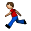

## Hi, my name is Carles and I do stuff!

Stuff I do:

- Write code  on **Github** at [@carlespla](http://github.com/carlespla)
- Share my runs  on [Strava](https://www.strava.com/athletes/31820634).
- Share things  on **Twitter** at [@carlespla](https://twitter.com/carlespla)
- Be on **LinkedIn**  as [carlespla](https://www.linkedin.com/in/esteveaguilera/)

This *web* has been created using [github pages](https://pages.github.com/) and [markdown](https://guides.github.com/features/mastering-markdown/), you can see the repo [here!](https://github.com/carlespla/carlespla.github.io)
